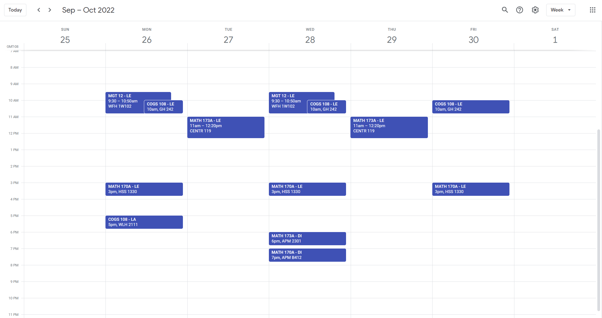

# 📆 calendarize-webreg

A bookmarklet for easily exporting your WebReg schedule to a calendar.  
- Adds your sections as recurring events
- Adds your finals as one time events



## 📋 Instructions
1. Copy & paste the blurb below as a URL into your bookmark bar (any name works)
2. Visit your WebReg page & click the bookmark to download your schedule as a calendar file (.ics)
3. Import the calendar file into your Google Calendar [here](https://calendar.google.com/calendar/u/0/r/settings/export)
4. Double check that the events created for your sections & finals match the times on WebReg!
```js
javascript:(function(){const icsDeps=document.createElement('script');icsDeps.src='https://adoryvo.github.io/calendarize-webreg/ics.deps.min.js';document.body.appendChild(icsDeps);const calendarize=document.createElement('script');calendarize.src='https://adoryvo.github.io/calendarize-webreg/calendarize.js';document.body.appendChild(calendarize);})()
```
