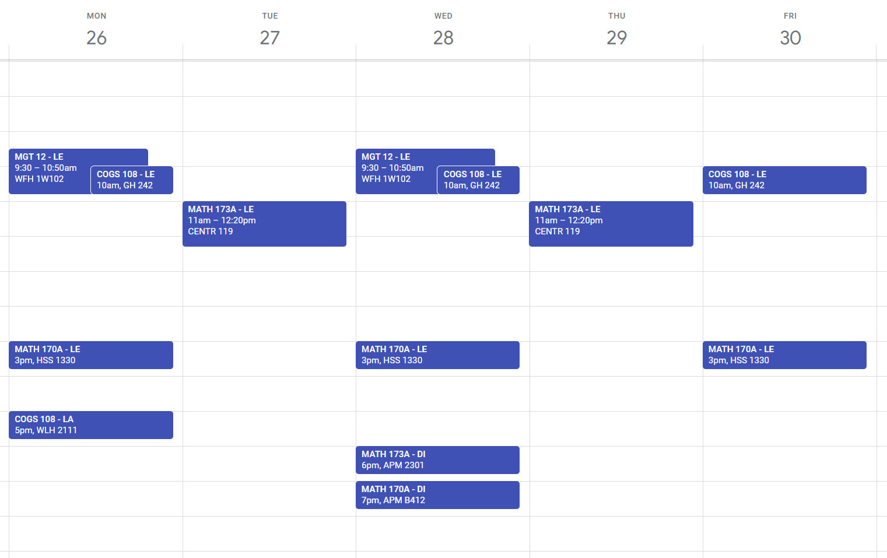

# 📆 calendarize-webreg

A [bookmarklet](https://en.wikipedia.org/wiki/Bookmarklet) for easily exporting your WebReg schedule to a calendar.
- Adds your classes as recurring events
- Adds your finals as one time events
- Importable into calendar apps like Google Calendar, Outlook, etc. 
- Usage instructions below!



## 📋 Instructions (for desktop)
1. Copy the entire code blurb below & add it as a new bookmark: `Ctrl+D` or `⌘+D`, click "More...", then paste the blurb in as the URL  
```js
javascript:(function(){const calendarize=document.createElement('script');calendarize.src='https://adoryvo.github.io/calendarize-webreg/calendarize.min.js';document.body.appendChild(calendarize);})()
```
2. Visit your WebReg page & click the bookmark to download your schedule as a calendar file (.ics)  
	(`Ctrl/⌘+Shift+B` to toggle bookmarks bar)
3. Import the calendar file into your Google Calendar [here](https://calendar.google.com/calendar/u/0/r/settings/export)
4. Double check that the calendar events created match the times on WebReg!

## ⭐ See also
- UCSD Rocket Dev Team's web-based [WebReg Export App](https://www.webreg-export.com/), which uses OCR image scanning to parse your WebReg schedule
- OTApps' [Chrome Extension tool](https://chrome.google.com/webstore/detail/ucsd-schedule-to-calendar/haafakimhdpglinagaadlgebflifeiho?hl=en-US)
- Isaiah Dailey's command line tool, [Schtoics](https://github.com/isaiahtx/Schtoics)
- [Feedback & Bug Report Form](https://forms.gle/nv2LUzE4SQ3fQVmX7)

---
*[Source code](https://github.com/AdoryVo/calendarize-webreg) | Uses [ics.js](https://github.com/nwcell/ics.js/) for .ics generation*  
*Created by [Adory Vo](https://github.com/AdoryVo)*
